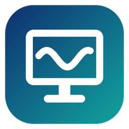

# TideDesk

**Remote access to your own computers.** Screen sharing, keyboard and mouse control,
system audio, and optional text clipboard sharing for Windows.

This development branch uses the [TideDesk Personal Use Source License](LICENSE):
free for personal, non-commercial use; other uses require separate written permission.
This is source-available software, not an OSI-approved open-source license.
Previously published releases through **v0.1.0-alpha.2 remain AGPL-3.0-only**;
the new terms do not revoke those permissions. See [licensing](docs/licensing.md).

[](https://github.com/cristiangirlea/tidedesk/releases)

Unzip and run `tidedesk.exe` on both computers — no installation needed. (Earlier releases also
shipped `tidedesk-host.exe` and `tidedesk-view.exe`: a start-up entry for the host moves to
`tidedesk.exe` by itself, and shortcuts to either need to point to `tidedesk.exe`.)

> Status: **early alpha**. Windows → Windows works on a local network. Linux, Android and iOS
> are planned. See the [roadmap](docs/ROADMAP.md).

The [roadmap](docs/ROADMAP.md) separates implemented features from future work.
Planned features are not included in the current release and have no promised dates.

## Why another remote desktop?

Classic VNC tools such as TightVNC were designed for a different era: they poll the screen,
compress it on the CPU as zlib/JPEG tiles, send everything over one TCP connection, protect
it with an 8-character DES password — and carry no sound at all.

TideDesk takes a modern route:

| | TideDesk | Classic VNC |
|---|---|---|
| Screen capture | DXGI Desktop Duplication — the GPU reports only real changes | Polling / hooks |
| Video | H.264, screen-content tuned | zlib/JPEG tiles |
| Sound | ✅ System audio, Opus, 10 ms frames | ❌ |
| Transport | QUIC over UDP: video, input and audio never block each other | Single TCP stream |
| Encryption | TLS 1.3, always on | Optional / weak |
| Auth | Access code proven via a session-bound HMAC (never sent), brute-force lock-out, host fingerprint pinning | DES password |
| Idle cost | ~0% CPU — nothing is captured or encoded while the screen is still | Keeps polling |

### Historical measurements (initial alpha, not re-measured for the current build)

On an AMD Ryzen 9 9950X (16 cores), streaming a 3840×2160 display over loopback:

| | CPU | RAM |
|---|---|---|
| Host, no viewer connected | 0.0% | 10 MB |
| Host, streaming 4K | ~13% of **one** core | ~270 MB |
| Viewer, showing 4K | ~5% of one core | ~210 MB |

Encoding cost per frame (software H.264): 8 ms at 1080p, 18 ms at 1440p, 37 ms at 4K.
These figures are not current performance guarantees. OpenH264 is currently the only
implemented video encoder. Hardware encoding and lower 4K memory use remain planned.

## Quick start

**On the computer you want to reach**, run `tidedesk`. The **Share this computer** tab shows
the **access code**, this computer's addresses and its **device ID**; TideDesk also sits in the
notification area (tray). Closing the window keeps it sharing there — quit from the tray menu.

**On the computer you are sitting at**, run `tidedesk`, open **Connect to a computer**, type the
device ID (or the address on a local network) and the access code, and press **Connect**. Save
computers you use often under **My computers** for one-click connections; access codes you
choose to remember are encrypted for your Windows account.

> **Give the access code only to someone you know and trust.** If a stranger asked you to
> install TideDesk or to read out the code, stop: they may be trying to take control of your
> computer.

The first time you connect, the viewer shows the host's fingerprint — check it matches the host
window. The viewer remembers it and refuses to connect if it ever changes.

Windows Firewall will ask to allow `tidedesk` the first time; allow it on private networks.

### Host settings

The host's **Settings** tab covers the shared screen, frame rate, quality, sound, UDP port,
whether viewers on the same network can find it by device ID, whether the window appears
in the taskbar, starting hidden in the tray, and starting when you sign in to Windows.
Settings are saved in `%APPDATA%\TideDesk\host.toml`.

### Command line

Either side alone, or from a terminal: `tidedesk host …` and `tidedesk view …` (plain
`tidedesk` opens the window with both).

```
tidedesk host --headless
tidedesk view 192.168.1.50 --code K7QM-3XPA-WZ
```

| Host | |
|---|---|
| `--headless` | No window or tray; print status to the console |
| `--tray` | Start hidden in the tray |
| `--list-displays` / `--display N` | Choose which monitor to share |
| `--fps 60` | Frame rate cap |
| `--bitrate 8000` | Video bitrate in kbit/s |
| `--no-audio` | Don't share sound |
| `--new-code` | Replace the access code |
| `--stats` | Print fps, bitrate and encode time |

Host options override the saved settings for that run only.

| Viewer | |
|---|---|
| `--no-audio` | Don't play the host's sound |
| `--fingerprint "3F2A 91C0 …"` | Verify the host on the very first connection |
| `--stats` | Print fps, bitrate and decode time |

The access code can also be supplied through the `TIDEDESK_CODE` environment variable.

### Clipboard and mouse controls

Viewer **Settings** includes text clipboard sharing (off by default) and host mouse
control (on by default), with customizable shortcuts. The defaults are **Ctrl+Alt+C**
for clipboard, **Ctrl+Alt+M** for mouse control, and **Ctrl+Alt+S** to open settings
while the remote window is focused. Host Settings has independent permissions for both.

After local host mouse movement, the next viewer movement aligns only the viewer's
pointer to the host's current position; later movements control the host from there.
This no-snap handoff is always enforced when mouse control is on.

See [clipboard and mouse controls](docs/interaction-controls.md). **Both computers
need the same protocol build**: this development branch uses protocol v3 and cannot
connect to the earlier v1/v2 alphas.

### Game Boost (experimental, v0.1.0-alpha.3)

Open Viewer **Settings** and press **Game Boost**, or toggle it during a session
with **Ctrl+Alt+G** (customizable). No reconnect is needed. Boost targets 60 FPS,
uses a motion-oriented software encoder preset, reduces the pending decode queue
and lowers audio buffering. Turning it off restores the host's desktop FPS.

Host resolution, configured bitrate, mouse permissions and clipboard permissions
stay unchanged. Actual FPS depends on the PCs, resolution and connection.
Keyboard and desktop mouse control work; relative mouse/game-camera capture,
hardware video acceleration, controllers and USB forwarding are not implemented.
See [Game Boost and testing](docs/game-boost.md).

### Over the internet (experimental, v0.1.0-alpha.5)

Direct internet connections run computer to computer, with no relay, by design. The
host shows its internet address. In the viewer, tick **Over the internet**, connect to
that address and give the viewer's address to the person at the host, who types it
under **Viewer on another network** and presses **Open**. Where no direct path is
possible (symmetric NAT, common on mobile data), a free VPN such as Tailscale still
works. Viewers can also connect by the host's **device ID**, even to a headless host:
TideDesk's own connection service introduces the two computers and never carries the
session (it can be changed or turned off in Settings). On the same local network a
device ID works even without the internet: the viewer asks the network too, and the
host answers directly. See
[internet access](docs/internet-access.md) and the
[design notes](docs/design/nat-traversal.md).

## Current limitations

- Windows only, one viewer at a time.
- The host runs as a normal app: UAC prompts and the sign-in screen can't be seen or controlled.
- An amber arrow shows the host pointer position even with mouse control off;
  the viewer's independent local pointer is a crosshair. Native host cursor shapes
  (such as text-selection and resize cursors) are not yet mirrored.
- Clipboard sharing is text-only, up to 48 KiB; images and file transfer are not supported.
- Shortcuts the viewer's Windows handles itself (Alt+Tab, Win key) stay local.

## Building from source

Requirements (Windows):

- [Rust](https://rustup.rs) (stable, MSVC toolchain)
- Visual Studio Build Tools with the C++ workload
- [CMake](https://cmake.org)
- [NASM](https://nasm.us) on `PATH` — optional but strongly recommended; without it the video
  encoder builds without its SIMD assembly and runs 3–4× slower (the build warns you).

```
cargo build --release --workspace --locked
```

The program lands in `target/release/tidedesk.exe` (both sides).

## Project layout

| Crate | Purpose |
|---|---|
| `tidedesk` | The one program: `tidedesk host …` and `tidedesk view …` |
| `tidedesk-core` | Platform-independent: wire protocol, auth, identity pinning, QUIC setup, audio helpers |
| `tidedesk-host` | Library: screen capture, H.264 encoding, audio capture, input injection |
| `tidedesk-view` | Library: window, H.264 decoding, audio playback, input capture |
| `third_party/egui_software_backend` | Vendored CPU renderer for the small app windows, with a repaint fix |

The app windows are drawn on the CPU with [egui](https://github.com/emilk/egui): an OpenGL or
Direct3D context alone can cost 150–500 MB on some graphics drivers, while each window here uses
about 10 MB. The remote screen itself is presented with `softbuffer`.

Platform-specific code sits behind small traits (`Capturer`, input backends), so Linux,
Android and iOS ports reuse the core and protocol unchanged.

## License

[TideDesk Personal Use Source License 1.0](LICENSE). Personal, non-commercial use is
free. Business use (including a company's internal IT support), resale, paid customer
support and product integration require separate written permission. No commercial
license is included with this source checkout.

The new terms apply only to versions supplied under them, not retroactively to earlier
AGPL releases. Third-party components retain their own licenses and notices.
See [licensing and earlier releases](docs/licensing.md).

Written by Cristian Girlea.

The icon is generated by `tools/make_icon.py`.

The H.264 codec is [OpenH264](https://github.com/cisco/openh264) (BSD-2-Clause), built from
source. Cisco's H.264 patent coverage applies only to Cisco's own prebuilt binaries; if you
redistribute TideDesk builds, check what applies in your jurisdiction.

## Code signing policy

The release executable is currently unsigned. Signing integration is prepared but is not
active until a signing provider has approved and configured the project. See the
[code signing policy](docs/code-signing-policy.md) and [release process](docs/releases.md).
