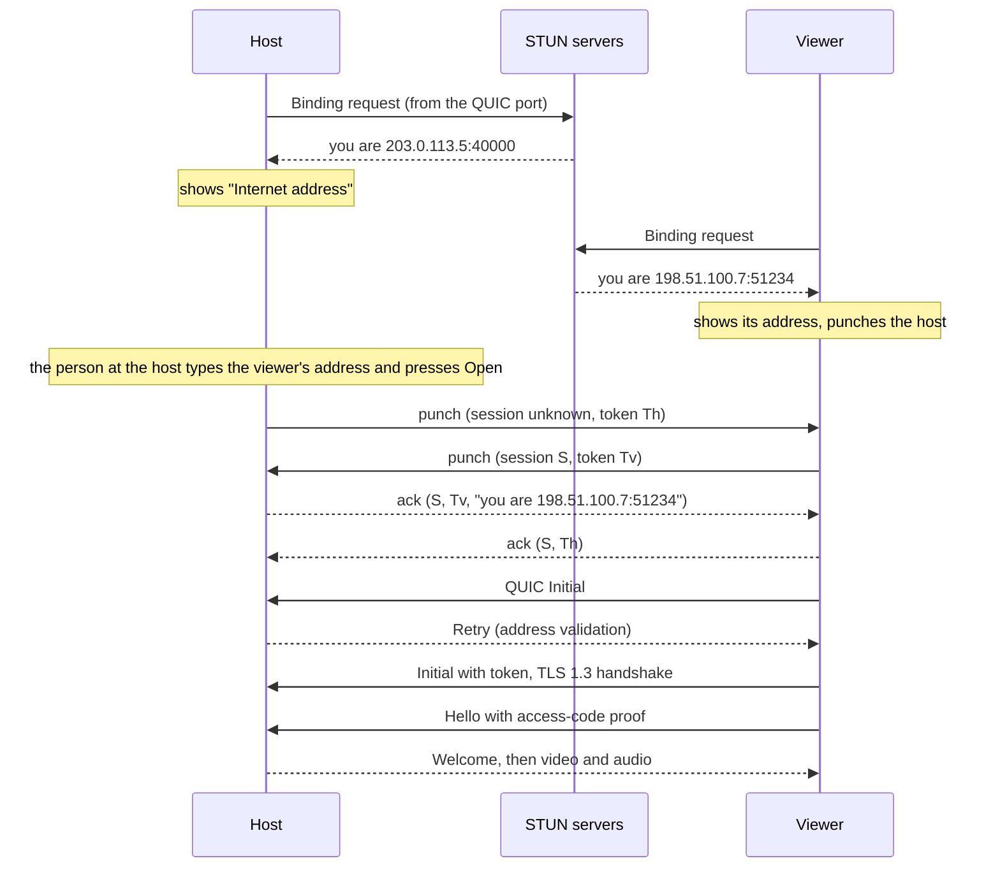

# Direct internet connections (NAT traversal)

Status: **experimental** in v0.1.0-alpha.5 (the manual exchange described here).
A rendezvous service that removes the manual step is planned; see the end of this
document.

## Goals and non-goals

- A viewer on one network reaches a host on another network, both behind ordinary
  home routers, with **every byte of the session going directly between the two
  computers**.
- **No relay, ever.** Helpers may only help the computers find each other; they
  never carry session data. When no direct path exists, TideDesk says so and points
  to a VPN or port forwarding instead of falling back to a relay.
- Security does not change: QUIC with TLS 1.3, the access-code proof bound to the TLS
  session, throttling of wrong codes and host fingerprint pinning work exactly as on a
  local network. `PROTOCOL_VERSION` stays 3.
- Not goals: IPv6 internet paths (IPv4 only for now), traversing symmetric NATs.

## One socket for everything

A router maps a computer's outgoing UDP traffic to a public address and port, and
only lets replies in through that mapping. So everything that opens or keeps a path
must use the same UDP socket QUIC uses. TideDesk wraps the socket quinn would create
(`nat::SharedSocket`, an `AsyncUdpSocket`) and splits incoming datagrams:

- **STUN** messages (bytes 4..8 are the RFC 5389 magic cookie) and **punch** packets
  (first bytes `00 'T' 'D' 'P'`) are diverted to a side channel.
- Everything else goes to QUIC.

Classification uses these explicit magics only. The QUIC "fixed bit" cannot be used:
quinn clears it at random towards peers that allow "greasing". TideDesk endpoints
disable greasing (`EndpointConfig::grease_quic_bit(false)`); since greasing depends on
the *peer's* transport parameter, alpha.4 peers never grease towards them either.
Windows may deliver several datagrams in one receive buffer (URO); the wrapper walks
each segment, diverts side-channel ones and compacts the rest in place without
changing the segment size.

A small actor (`nat::Agent`) owns the side channel and fans datagrams out to whoever
waits: a STUN round or a punch exchange.

## Learning the internet address (STUN)

The agent sends RFC 5389 Binding requests to two public servers (by default
`stun.l.google.com:19302` and `stun.cloudflare.com:3478`, configurable) and reads the
XOR-MAPPED-ADDRESS of the replies.

- Requests are resent after 0.5, 1.5 and 3.5 seconds; a round gives up after 7.5 s.
  Once one server answered, the others get 2 more seconds.
- **NAT kind**: the same public address and port from both servers means an
  endpoint-independent mapping, which punching can traverse. Different ports mean a
  **symmetric NAT**: the address seen by one peer is useless to another, so a direct
  path is impossible and TideDesk says so up front.
- The host repeats the round every 25 seconds, which also keeps its router mapping
  alive. The earliest configured server that answered names the address, so it does
  not change with whichever reply was faster.
- Privacy: each request is 20 bytes with no content; the server learns the public IP
  address and port. Hosts can turn this off or choose other servers (Settings,
  Internet). See the privacy section of the [code signing policy](../code-signing-policy.md).

## Punching

Both computers send small datagrams to each other's public address from the QUIC
port. Each router then has seen traffic go out to the other side and lets its
packets in.

| bytes  | field |
|--------|-------|
| 0..4   | magic `00 'T' 'D' 'P'` |
| 4      | version (1) |
| 5      | kind: 0 punch, 1 ack |
| 6..8   | reserved, zero |
| 8..16  | session ID, shared by both sides; zero while unknown |
| 16..24 | token, random per side; an ack echoes the token of the punch it answers |
| 24..40 | in an ack: the address the punch came from (IPv6 or IPv4-mapped) |
| 40..42 | in an ack: that address's port |

- Punch and ack are both 42 bytes, so answering cannot amplify traffic towards a
  spoofed source.
- Each side punches every 200 ms, answers the other side's punches with acks, and
  counts the path as **open once an ack echoes its own token**: its packets arrive,
  and the answers come back. Then keepalive punches follow every 2 seconds for up to
  3 minutes, until QUIC's own 5-second keep-alive carries the path.
- Packets are accepted from the peer's IP address on any port, and punches follow the
  port that answered: routers may use another port towards the peer than the one STUN
  reported.
- The viewer picks a random session ID. The host starts without one and answers every
  session from the viewer's IP, so a viewer can retry from a new socket.
- A punching window is at most 3 minutes, which bounds traffic to a mistyped address.

## The connection (Phase A: manual exchange)

1. The host shows its internet address (Status tab).
2. The viewer is given that address with "Over the internet" ticked (or
   `tidedesk-view --internet`). It learns its own address, refuses early when its
   network uses a symmetric NAT or has the same public IP as the host (same network:
   use the local address), shows its address and starts punching for 2 minutes.
3. The person at the host types the viewer's address under "Viewer on another
   network" and presses **Open**; the host punches for 2 minutes.
4. As soon as both see each other's acks, the viewer opens the normal QUIC connection
   over the path.
5. While punching, the viewer also tries the host's address directly after 5 seconds:
   a host whose UDP port is forwarded answers without anyone pressing Open.

In the viewer window, all of this runs in the session process, which owns the socket
and the path. It reports each step to the window as text lines (`status:`,
`viewer-address:`, `fingerprint:`, `connected:`, `error:`, `disconnected:`) and takes
`trust` or `cancel` on its standard input.

## Security

- The path changes nothing above UDP: TLS 1.3 with the host's certificate, the
  access-code proof bound to the TLS exporter, throttling and pinning are unchanged. No
  helper sees the code or can impersonate the host.
- Hosts answer every connection attempt from an unproven address with a QUIC Retry
  (one extra round trip), so a spoofed source never gets handshake work or data.
- **Pinning**: on internet routes the host's public port may change with every
  restart, so a fingerprint pinned under any address counts as trusted and the
  changing address is not stored. An unknown fingerprint at a new address is a first
  connection and asks for confirmation; a different fingerprint at a known address is
  still reported as a changed identity. Local connections keep exact per-address
  pinning.
- Anyone who learns a host's internet address can attempt the access code, as with
  port forwarding; wrong codes are throttled.

## Firewalls

The host sends the first packets to the viewer, so Windows Firewall should treat the
viewer's packets as answers and let them in; checklist item 5 below confirms this per
release. If a host's firewall blocks them anyway, allow TideDesk Host on the network
in use. The viewer never needs an
inbound rule.

## Limits

- **Symmetric NAT** on either side (common on mobile data and carrier-grade NAT) makes
  a direct path impossible. TideDesk detects it and suggests a VPN such as Tailscale
  or port forwarding. It never relays.
- Two computers behind the **same router** should use the local address: many routers
  cannot loop traffic back to their own public address.
- IPv4 only.
- Someone must be at the host window to press Open (a `--headless` host cannot open
  a path yet), and both sides must act within two minutes of each other.

## Phase B: rendezvous by device ID (experimental)

A small UDP service remembers each registered host's public address under a stable
**device ID**: the first 64 bits of the SHA-256 of the host's certificate, shown as
`TD-XXXX-XXXX-XXXX-XXXX`. It is off until a service is configured on both sides. The
wire format is the `tidedesk-rendezvous-proto` crate here; the service TideDesk runs
is maintained separately, and the host and viewer tests that need one run against it
(`TIDEDESK_TEST_SERVICE=ip:port`, otherwise ignored).

- **Registration.** The host says Hello to both service ports (the second port's
  answer classifies its NAT), gets a challenge bound to its address, and registers by
  signing the challenge with its certificate's key; the service checks that the ID is
  the certificate's hash. The host refreshes every 25 seconds, which also keeps its
  router mapping alive; the service forgets it 75 seconds after the last refresh.
- **Lookup.** The viewer says Hello too, then asks for the ID with its own challenge,
  so the service only introduces addresses that proved they are real. The service
  answers the viewer with the host's address and a session, and tells the host the
  viewer's address with the same session. Both punch as above; the host punches for
  30 seconds, at most 10 introductions a minute.
- **Identity.** The viewer refuses a host whose certificate does not hash to the ID
  it asked for, so neither the service nor anyone else can impersonate a host. There
  is no fingerprint question: the ID is the fingerprint's start. 64 bits keep forging
  an ID out of reach (about 2^64 work).
- The service never sees the access code or session data and keeps everything in
  memory. A Hello is padded to at least the size of its answer; registrations and
  lookups must return a challenge sent to the sender's own address, and refreshes a
  secret token, so a forged source address gains nothing. Each address is rate-limited.

## Validation checklist

Record results before each release that changes this area.

1. Local network: probe, confirm and session as before.
2. Home router and phone hotspot: the hotspot side reports a symmetric NAT and fails
   fast with the VPN advice.
3. Two different home routers: after the second side presses Open, the path opens
   within about a second and the session starts within a few seconds. The viewer's
   `path:` line and the host's "connected from" line each show the other side's
   public address. Ten minutes with `--stats`: round-trip time close to a ping between
   the public addresses, low loss.
4. Same router, public addresses: the viewer says to use the local address.
5. Host firewall rule disabled temporarily: repeat 3 and note the result.
6. Host restart (new public port): no "identity changed" on the next connection.
7. Wrong access code over the internet: one throttled failure per attempt; punches
   never count as attempts.
